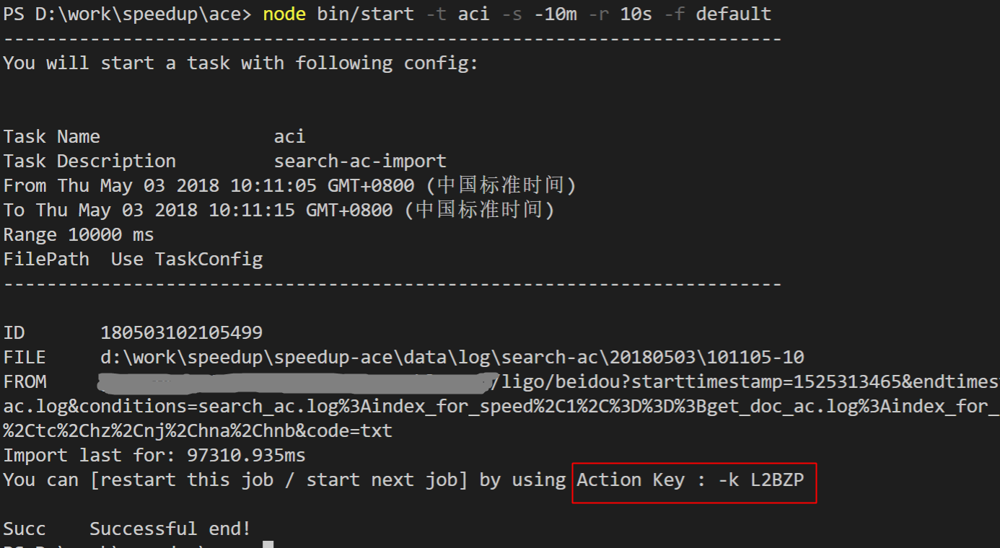

# What`s ACE
ACE is a framework of processing log data  , including , but not limited to , Analysis , Calculate and Evaluate.

## 简介
ACE Frame 是一个开放过程的数据处理框架，除了提高业务数据报表产出的效率外，更注重让更多业务角色快速、独立参与数据分析。框架主要聚焦数据处理过程（入库、转储、Map、Reduce、数据分析、数据评价、报表整合、任务调度、日程管理等）。

ACE 主要处理“原数据”至“报表数据”产出过程，不负责数据存储及数据通路，不负责数据展现。但是框架会兼容绝大多数的数据接入方式（如Ftp、Hadoop、北斗），及数据报表格式（ShowX、Spy、Speedup等），无缝关联指标及各展现平台结果。


# 快速上手

在本章节我们的目标是搭建框架和项目，了解主要配置，并使用命令行完成数据入库（import）/转储（transfer）/计算处理（caculate）

## 初始化

进入ace框架根目录，通过执行以下命令，会完成依赖的npm包安装

```bash
    # 安装依赖
    make install

```

## Project配置
**目前该项目为调试维护状态，生成Project Config的 CLI后续推出**

ACE是一个工具框架，要与配置结合才能正常运行起来。配置在项目（Project）工程下的\config目录下，包含了所需的各种配置

[speedup-ace](http://gitlab.baidu.com/speedup/speedup-ace)就是一个项目工程，包含了一些任务实例的配置，你可以git clone到本地目录，并修改框架环境配置（conf/enviroment.json.default）如下，并重命名为enviroment.json启用

```JSON
    // 支持多个Project，缺省载入base-project指定的项目
    // 其他Project可以在使用命令时通过-p 参数指定
    {
        "base-project": "speedup-ace",
        "speedup-ace": {
            // 以下是speedup-ace项目的具体配置
            // root指向speedup-ace的目录
            "root" : "d:\\work\\speedup\\speedup-ace"
        }
    }
```

## 使用Bin

下面以import数据为例，了解bin的常规使用方法

```bash
# 查看import支持的命令及完整DEMO
bin/start --help

# -t aci是指定启动aci任务（一个下载search_ac日志的任务配置）
# 时间范围从-s 到 -e的时间，时间支持非空格的字符切分，支持精确到天/分钟/秒三种选择
bin/start -t aci -s 20180401.1200.00 -e 20180401120010

```

关于时间还有其他简便高效的使用方式：

```bash
# 不指定结束时间，采用-r参数指定一段时间，支持单位d/m/s/ms(day/minute/seconde/ms)
bin/start -t aci -s 20180401.1200.00 -r 10s
# -s/e 时间参数支持倒推一段时间，请采用-开头，支持d/m/s/ms(day/minute/seconde/ms)
bin/start -t aci -s -5m -r 10s
```

刚才的命令执行后，数据被打印到控制台，如果希望存入文件可以使用-f 命令指定文件

```bash
#-f 自定义基于当前命令行的存储路径./rs.log 或 使用project配置生成 -f default 不指定-f会直接打印
bin/start -t aci -s 20180401120000 -r 10s -f ./rs.log
```

你也可以使用-f default来配合[配置](http://gitlab.baidu.com/speedup/speedup-ace/blob/master/config/source/file.json)自动存储到指定位置(data/middle/search-ac/20180401/120000-10)

使用-l参数可以指定不同日志等级调节控制台的信息呈现

使用-p参数可以指定其他的项目配置（默认是base-project）

```bash
# 默认会打印L5级别的日志，如果不希望打印任何日志可以设置0级别，如果希望打印所有细节调试可以设置9级别
bin/start -t aci -s -5m -r 10s -l 0
# 同上章节介绍，通过使用-p命令临时切换指定project的配置，而非使用缺省配置
bin/start -t aci -s -5m -r 10s -p speedup-ace

```

在完成import后会得到一个key，后续进行转储（transfer）数据时可以采用-k key复用import时候指定的一些参数，提高生产效率。



``` bash
# 转储的task id是act，配合key继续转储如下：
bin/start -t act -k L2BZP
```

aci和act任务都是通过[配置](http://gitlab.baidu.com/speedup/speedup-ace/blob/master/config/task/search-ac.json)实现的，任务配置其实是主要指定了输入、输出源（Source）和处理过程（pipelines），配置中还有一个acit任务，通过调整pipelines组合同时完成了import和tansfer操作，关于如何进行配置会在**最佳实践**章节中进行阐述。

act的产物按照目前的配置是个格式化文档，可以通过xls直接打开，第一行是字段表头，第二行开始是数据。

``` bash
bin/start -t acc -k L2BZP
```

接下来我们通过已经配置好的acc任务可以将act的产出文档转换为初步报表。


** 初步报表=>showX展现，待补充 **

# 最佳实践

在本章节我们会详细讲解源（Source）、管道（Pipeline）如何配置以实现任务，如何配置日程（Schedule）以实现任务例行。

**待补充**

## Source

## Pipeline

## Middleware

## Schedule

## 守护进程

# 开发者文档
以下章节内容待调整

**您可以通过以下安装步骤，开始框架的开发与调试**

安装Node.js(版本>=4), Make, fis3:

```bash
brew install make
npm install -g fis3
```

依赖管理：

```bash
# 安装npm、apm所有依赖
make install

#只更新npm依赖
make update-apm
```

apm发布管理：

```bash
# 发布更新apm组件，需要手动更新版本号进行确认
make apm-publish

# apm环境安装
make apm-instal

# apm注册登录
make apm-login
```


更新API文档：

```bash
# 根据jsdoc更新doc/api
make doc
```

## 架构

### How Pipeline & Middleware Work
Pipeline（管道）与Middleware（中间件）是框架实现数据流操作的重要结构，这套模式的优点：

- **高可配置化**：业务逻辑完全剥离框架，以纯conf配置形式驱动管道组合、数据分析、I/O存取
- **高可伸缩性**：通过对管道顺序调整，可以拆除或降低I/O管道的优先级，动态调整性能；也可以通过加入缓存管道协调单进程间的reduce阻塞
- **易扩展** 已经有简易版本的mapper&reducer pipeline，这意味着打包两个阶段的pipeline及配置就可以快速实现hadoop集群计算，满足更大吞吐的数据分析；同时通过设计pipeline保证产出数据的一致性使得未来可能实现小规模机器间的数据资源交换

数据在pipeline组合中的处理流程：


一份简搜的gz数据解压->切分->存入xls文件的过程

```
    "scraft_cus": {
        // 输入源 本地log日志
        "input-source": "file.scraft_cus_log",
        // 输出源 本地mid文件
        "output-source": "file.scraft_cus_mid",
        // 处理管道: gz解压/line按行读取/mapper切分字段/map格式化为table带表头格式/table rows join间隔输出为行文本
        "pipeline":[
            "common.gunzip",
            "common.line",
            "scraft_cus.input_split",
            "scraft_cus.table_format"
        ]
    }
```
当然也可以选择直接产出report数据，可以如下调整pipeline：

```
        "pipeline":[
            "common.gunzip",
            "common.line",
            "scraft_cus.input_split",
            // 因为不再存储数据，摘离表格格式化和反格式化及按line分片管道，直接接入mapper+reducer
            // "scraft_cus.table_format",
            // "common.line",
            // "common.table_parser",
            "scraft_cus.mapper",
            "common.reducer_speed",
            "common.table_format"
        ]
```

数据在pipeline中通过使用middleware进行处理的流程：


在上述的“input_split” 管道中对行日志进行了复杂的切分，以产出mapper需要的kv键值对，我们通过配置进一步了解middleware模式组件与middleware功能组件的关系：

```
    "input_split": {
        "module": "transform-middleware",
        "middleware": {
            "module": "middleware-chain",
            // 指定串行middleware组并依次序运行
            "chains": [
                {
                    "module": "middleware-separate",
                    // 按\t分隔符切分为array
                    "separate": "\t"
                },
                {
                    "module": "middleware-multiple",
                    // 为输入的array分别指定middleware
                    "each":[
                        null,null,
                        "sys",
                        {
                            // 按正则分析host字段
                            "module": "middleware-regexp",
                            "partten": "/^http(s)?:\\/\\/(.*?)\\/\/",
                            "column": "host",
                            "index": 2
                        },
                        {
                            // 解析performance-JSON字段，并计算部分时间段并输出kv键值对
                            "module": "middleware-performance",
                            "columns": [
                                "lookup","waiting","request","receiving","init","parsing","content","load",
                                "fetch","loadend","appcache","connect","domReady"
                                // [ 'fetch'         , ['fetchStart', 'navigationStart']                   ]
                            ]
                        }
                    ]
                },
                // 对上述多路middleware产生的机组键值对进行merge，产出一个{k:v,k:v,k:v}键值对
                {"module": "middleware-merge"}
            ]
        }
    }
```
更复杂的日志切分可以参考ac日志切分配置：
http://gitlab.baidu.com/speedup/speedup-ace/blob/master/config/pipeline/search_ac.conf

上述配置较为复杂，但并不推荐业务日志如此复杂（也验证了以上模式带来的高度可配置化）。规范日志会简化数据配置、提升运行时效率，后续也会通过推出打点日志CLI工具来协助产生标准的日志打点js及pipeline配置。

### Config

### Task

### Cron

### Alpha版本的排期 及 Beta版本展望

框架在开发之初有比较相对明确的目标和模式要求，不过鉴于模块化和配置化开发经验，Alpha版本开发可能相对不友好或不够抽象，但框架在发布Beta版本前有以下计划来保障最终目标：

- 以两条业务流程为参照来验证主要功能
- 框架抽象pipeline、middleware为核心模块，重新设计两者及实现类的接口，发布为单独模块
- 配合抽象后的pipeline、middleware重写配置机制，使得编写conf更友好
- 弱化Task为pipeline配置组合，采用分流T管道完成中间环节的文件转储，提高报表产出效率
- 针对pipeline配置组合抽象新的Task机制，实现Task挂起、恢复、重试
- 整理其他框架代码及单测 或 寻求其他的npm包替代 DRY!!! 
- 开发文档 && 配置文档
- github && publish npm
- conf脚手架 && 可视化脚手架
- 打点模块 && 打点脚手架

尚不确定的想法（但在Beta版本后）：
- 以微服务模式重新设计Service
- 基于pipeline模式的开发有点像Reactive，是否可以借鉴RxJS