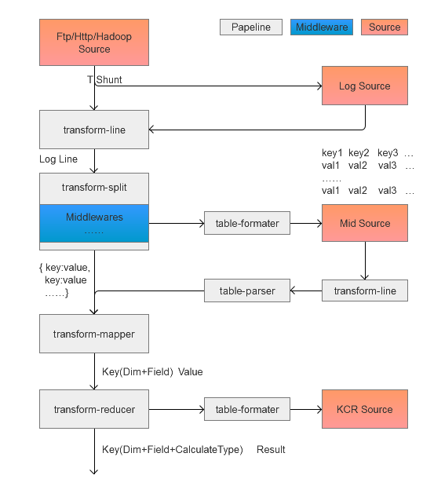
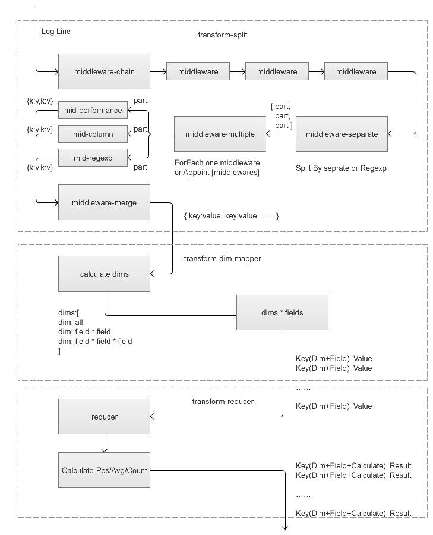

# What`s ACE
ACE is a framework of processing log data  , including , but not limited to , Analysis , Calculate and Evaluate.

## 简介
ACE Frame 是在实现Speedup及相关业务需求过程中总结出来的数据分析、量化、评价框架，特点是开放处理过程，满足更多业务角色快速参与数据分析。框架主要聚焦数据处理、数据分析、任务调度等过程的模块化封装。

ACE 主要处理“原数据”至“报表数据”产出过程，不负责数据存储及数据通路，不负责数据展现。但是框架会兼容绝大多数的数据接入方式（如Ftp、Hadoop、北斗），及数据报表格式（ShowX、Spy、Speedup等），无缝关联指标及各展现平台结果。


## Start Your ACE Project Instance

### Project配置
**目前该项目为调试维护状态，生成Project Config的 CLI后续推出**

您可以从 http://gitlab.baidu.com/speedup/speedup-ace 获取已运用ace的speedup project，并通过修改框架\config\main.conf的speedup-ace 的root指向您的speedup project的目录。
```bash
    # 支持多个Project，缺省载入base-project
    # 如果您在执行任何bin时不希望使用使用缺省base-project的配置，可以附加-p project-name 指定已配置的project
    {
        "base-project": "speedup-ace",
        "speedup-ace": {
            "root" : "d:\\work\\speedup\\speedup-ace"
        }
    }
```

### 初始化

通过执行以下命令，会完成依赖的npm包安装，该命令会安装一个全局的模块forever以便于启动Service

```bash
    # 安装依赖
    make install

    # 如果您需要启动Service
    make start

    # 查看Service
    forever list

    # 停止
    make stop
```

关于Service的相关配置会在 **Service** 章节介绍

### 使用Bin

下面以download数据为例，了解bin的常规使用方法

```bash
# 查看import支持的命令及完整DEMO
bin/import --help

# 下载search_ac日志，时间范围从-s 到 -e的时间，时间支持非空格的字符切分，支持精确到天/分钟/秒三种选择
bin/import -t search_ac -s 20180401.1200.00 -e 20180401120010
# 不指定结束时间，采用-r参数指定一段时间，支持单位d/m/s/ms(day/minute/seconde/ms)
bin/import -t search_ac -s 20180401.1200.00 -r 10s
# -s/e 时间参数支持倒推一段时间，请采用-开头，支持d/m/s/ms(day/minute/seconde/ms)
bin/import -t search_ac -s -5m -r 10s

#-f 自定义基于当前命令行的存储路径./rs.log 或 使用project配置生成 -f default 不指定-f会直接打印
bin/import -t search_ac -s 20180401120000 -r 10s -f ./rs.log
# 默认会打印L5级别的日志，如果不希望打印任何日志可以设置0级别，如果希望打印所有细节调试可以设置9级别
bin/import -t search_ac -s -5m -r 10s -l 0
# 同上章节介绍，通过使用-p命令临时切换指定project的配置，而非使用缺省配置
bin/import -t search_ac -s -5m -r 10s -p speedup-ace 

```

更多的bin命令，请移步docs/bin了解（建设中）


## Develop ACE Frame

**您可以通过以下安装步骤，开始框架的开发与调试**

安装Node.js(版本>=4), Make, fis3:

```bash
brew install make
npm install -g fis3
```

依赖管理：

```bash
# 安装npm、apm所有依赖
make install

#只更新npm依赖
make update-apm
```

apm发布管理：

```bash
# 发布更新apm组件，需要手动更新版本号进行确认
make apm-publish

# apm环境安装
make apm-instal

# apm注册登录
make apm-login
```


更新API文档：

```bash
# 根据jsdoc更新doc/api
make doc
```

## 架构

框架在开发之初有比较相对明确的目标和模式要求，不过鉴于模块化和配置化开发经验，Alpha版本开发可能相对不友好或不够抽象，但框架在发布Beta版本前有以下计划来保障最终目标：

- 以两条业务流程为参照来验证主要功能
- 框架抽象pipeline、middleware为核心模块，重新设计两者及实现类的接口，发布为单独模块
- 配合抽象后的pipeline、middleware重写配置机制，使得编写conf更友好
- 弱化Task为pipeline配置组合，采用分流T管道完成中间环节的文件转储，提高报表产出效率
- 针对pipeline配置组合抽象新的Task机制，实现Task挂起、恢复、重试
- 整理其他框架代码及单测 或 寻求其他的npm包替代 DRY!!! 
- 开发文档 && 配置文档
- github && publish npm
- conf脚手架 && 可视化脚手架
- 打点模块 && 打点脚手架

尚不确定的想法（但在Beta版本后）：
- 以微服务模式重新设计Service
- 基于pipeline模式的开发有点像Reactive，是否可以借鉴RxJS


### How Pipeline & Middleware Work
Pipeline（管道）与Middleware（中间件）是框架实现数据流操作的重要结构，这套模式的优点：

- *高度配置化*：业务逻辑完全剥离框架，以纯conf配置形式驱动管道组合、数据分析、I/O存取
- *高可伸缩性*：通过对管道顺序调整，可以拆除或降低I/O管道的优先级，动态调整性能；也可以通过加入缓存管道协调单进程间的reduce阻塞
- *易扩展*：已经实现的pipeline流程中参照实现了mapper&reducer，这意味着打包两个阶段的模块及配置就可以快速实现hadoop集群计算，满足更大吞吐的计算；同时部分pipeline产出数据的一致性使得未来可能实现小规模分布式的计算

数据在pipeline组合中的处理流程：



一份简搜的gz数据解压->切分->存入xls文件的过程

```
    "scraft_cus": {
        // 输入源 本地log日志
        "input-source": "file.scraft_cus_log",
        // 输出源 本地mid文件
        "output-source": "file.scraft_cus_mid",
        // 处理管道: gz解压/line按行读取/mapper切分字段/map格式化为table带表头格式/table rows join间隔输出为行文本
        "pipeline":[
            "common.gunzip",
            "common.line",
            "scraft_cus.input_split",
            "scraft_cus.table_format"
        ]
    }
```
当然也可以选择直接产出report数据，可以如下调整pipeline：

```
        "pipeline":[
            "common.gunzip",
            "common.line",
            "scraft_cus.input_split",
            // 因为不再存储数据，摘离表格格式化和反格式化及按line分片管道，直接接入mapper+reducer
            // "scraft_cus.table_format",
            // "common.line",
            // "common.table_parser",
            "scraft_cus.mapper",
            "common.reducer_speed",
            "common.table_format"
        ]
```

数据在pipeline中通过使用middleware进行处理的流程：




在上述的“input_split” 管道中对行日志进行了复杂的切分，以产出mapper需要的kv键值对，我们通过配置进一步了解middleware模式组件与middleware功能组件的关系：

```
    "input_split": {
        "module": "transform-middleware",
        "middleware": {
            "module": "middleware-chain",
            // 指定串行middleware组并依次序运行
            "chains": [
                {
                    "module": "middleware-separate",
                    // 按\t分隔符切分为array
                    "separate": "\t"
                },
                {
                    "module": "middleware-multiple",
                    // 为输入的array分别指定middleware
                    "each":[
                        null,null,
                        "sys",
                        {
                            // 按正则分析host字段
                            "module": "middleware-regexp",
                            "partten": "/^http(s)?:\\/\\/(.*?)\\/\/",
                            "column": "host",
                            "index": 2
                        },
                        {
                            // 解析performance-JSON字段，并计算部分时间段并输出kv键值对
                            "module": "middleware-performance",
                            "columns": [
                                "lookup","waiting","request","receiving","init","parsing","content","load",
                                "fetch","loadend","appcache","connect","domReady"
                                // [ 'fetch'         , ['fetchStart', 'navigationStart']                   ]
                            ]
                        }
                    ]
                },
                // 对上述多路middleware产生的机组键值对进行merge，产出一个{k:v,k:v,k:v}键值对
                {"module": "middleware-merge"}
            ]
        }
    }
```
更复杂的日志切分可以参考ac日志切分配置：
http://gitlab.baidu.com/speedup/speedup-ace/blob/master/config/pipeline/search_ac.conf

上述配置较为复杂，但并不推荐业务日志如此复杂（也验证了以上模式带来的高度可配置化）。规范日志会简化数据配置、提升运行时效率，后续也会通过推出打点日志CLI工具来协助产生标准的日志打点js及pipeline配置。